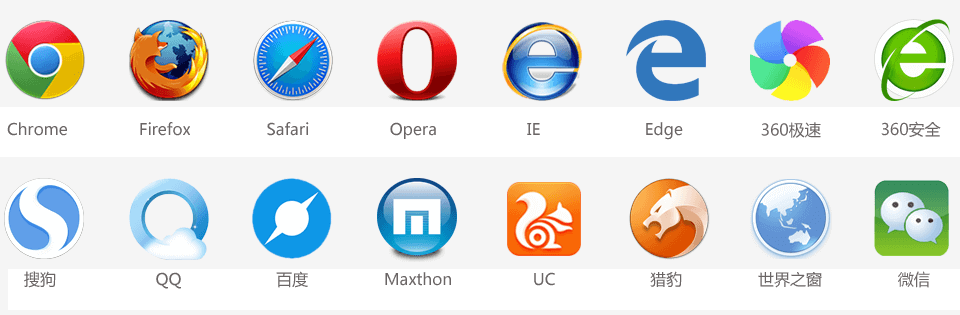
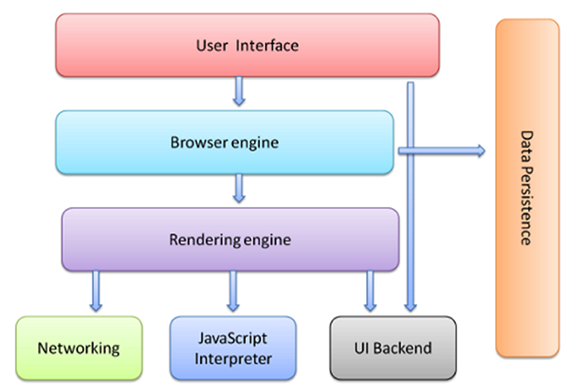

## 常见的浏览器

浏览器是网页运行的平台，常见的浏览器有谷歌（Chrome）、Safari、火狐（Firefox）、IE、Edge、Opera等。如下图所示：

## 浏览器的组成

浏览器分成两部分：

- 1、渲染引擎（即：浏览器内核）

- 2、JS 引擎

### 1、渲染引擎（浏览器内核）

浏览器所采用的「渲染引擎」也称之为「浏览器内核」，用来解析 HTML与CSS。渲染引擎决定了浏览器如何显示网页的内容以及页面的格式信息。

**渲染引擎是浏览器兼容性问题出现的根本原因。**

渲染引擎的英文叫做 Rendering Engine。通俗来说，它的作用就是：读取网页内容，计算网页的显示方式并显示在页面上。

常见浏览器的内核如下：

|    浏览器    |  内核  |
| :----------: | :----: |
|    chrome    | Blink  |
|     Edge     | Blink  |
|    Safari    | Webkit |
| Firefox 火狐 | Gecko  |

### 2、JS 引擎

也称为 JS 解释器。 用来解析网页中的JavaScript代码，对其处理后再运行。

浏览器本身并不会执行JS代码，而是通过内置 JavaScript 引擎(解释器) 来执行 JS 代码 。JS 引擎执行代码时会逐行解释每一句源码（转换为机器语言），然后由计算机去执行。所以 JavaScript 语言归为脚本语言，会逐行解释执行。

常见浏览器的 JS 引擎如下：

|    浏览器     | JS 引擎                                                               |
| :-----------: | :-------------------------------------------------------------------- |
| chrome / 欧鹏 | V8                                                                    |
|    Safari     | Nitro                                                                 |
| Firefox 火狐  | SpiderMonkey（1.0-3.0）/ TraceMonkey（3.5-3.6）/ JaegerMonkey（4.0-） |

## 浏览器工作原理 （先跳过知道就行）

> 这一小段有些深入，小白可以暂时跳过，以后学习JS的时候再回来看。

浏览器主要由下面这个七个部分组成：

1. User Interface（UI界面）：包括地址栏、前进/后退按钮、书签菜单等。也就是浏览器主窗口之外的其他部分。

1. Browser engine （浏览器引擎）：用来查询和操作渲染引擎。是UI界面和渲染引擎之间的**桥梁**。

1. Rendering engine（渲染引擎）：用于解析HTML和CSS，并将解析后的内容显示在浏览器上。

1. Networking （网络模块）：用于发送网络请求。

1. JavaScript Interpreter（JavaScript解析器）：用于解析和执行 JavaScript 代码。

1. UI Backend（UI后端）：用于绘制组合框、弹窗等窗口小组件。它会调用操作系统的UI方法。

1. Data Persistence（数据存储模块）：比如数据存储  cookie、HTML5中的localStorage、sessionStorage。

参考链接：（关于浏览器的工作管理，下面这篇文章，是精品中的精品，是必须要知道的）

- [How Browsers Work: Behind the scenes of modern web browsers](https://www.html5rocks.com/en/tutorials/internals/howbrowserswork/)

