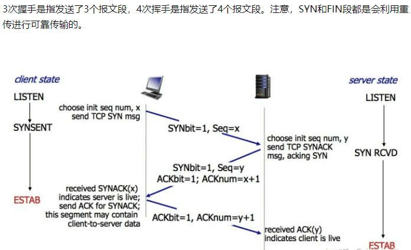

# 计算机知识简介
 
- 操作系统
  - PC 操作系统：Windows， Macos， Linux， Unix， 
  - 移动端操作系统： IOS, Android, 等
  - 用户态，内核态
  - **进程，线程**
    - 2者的定义是什么，区别是什么。  
       
    - 进程之间如何通讯
    - 线程之间如何通讯
- 计算机网络
  - OSI 七层协议  
  <!--  -->
  - 三次握手  
  <!--  -->
  - 四次挥手  
  <!--  -->
- 文件系统
  - FAT，FAT32，NTFS，EXT，ZFS，CDFS，exFAT，RAW 等等
- 数据库
  - 按模型分
    - 层次模型
    - 网状模型
    - 关系模型（三范式）
  - 主流关系型数据库
    - 商用数据库，例如：**Oracle**，**SQL Server**，DB2等
    - 开源数据库，例如：**MySQL**，**PostgreSQL**等
    - 桌面数据库，以微软 Access 为代表，适合桌面应用程序使用
    - 嵌入式数据库，以**Sqlite**为代表，适合手机应用和桌面程序
  - 非关系型数据库
    - **redis** （key-value 数据库）等
- 数据结构与算法
- 汇编
- 编译原理
- 设计模式
<!-- - 系统编程
- 框架开发技能
- 计算机内部是二进制。即数字逢二进一。 -->