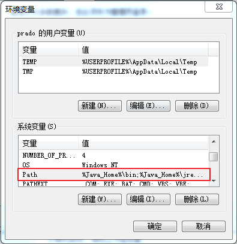

## JAVA windows 环境搭建

### JDK 安装
- 下载JDK [https://www.oracle.com/java/technologies/downloads/](https://www.oracle.com/java/technologies/downloads/)

- 环境变量配置  
  
   

    

   

变量名字：
 JAVA_HOME
 变量值：java的安装目录 如 C:\Program Files\Java\jdk1.8.0_341

变量名：Path
变量值：%JAVA_HOME%\bin;%JAVA_HOME%\jre\bin;  

   

    

   

   

 
测试JDK是否安装成功：
- "开始"->"运行"，键入 `cmd`.
- 键入命令: `java -version` ，出现以下信息，说明环境变量配置成功.  

 

