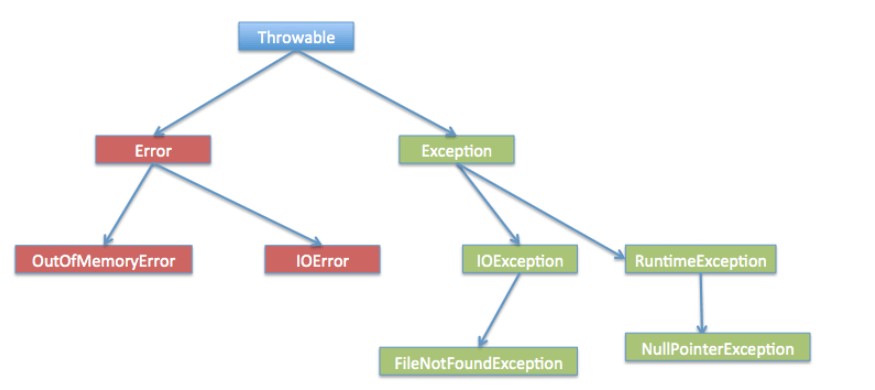

## Exception
- 异常是程序中的一些错误，但并不是所有的错误都是异常，并且错误有时候是可以避免的。

比如说， 用`System.out.println(11/0)`，那么你是因为你用0做了除数，会抛出 `java.lang.ArithmeticException` 的异常。

## assert
断言（`Assertion`）是一种**调试**程序的方式。在`Java`中，使用`assert`关键字来实现断言。
```
public static void main(String[] args) {
    double x = Math.abs(-123.45);
    assert x >= 0;
    System.out.println(x);
}
```
语句`assert x >= 0;`即为断言，断言条件x >= 0预期为true。如果计算结果为false，则断言失败，抛出`AssertionError`。

## Error
- 错误一般发生在严重故障时，它们在Java程序处理的范畴之外。
- `Error` 用来指示运行时环境发生的错误。如，JVM 内存溢出等。

## throw throws
- 如果一个方法没有捕获到一个检查性异常，那么该方法必须使用 `throws` 关键字来声明。`throws` 关键字放在方法签名的尾部。
- 可以使用 `throw` 关键字抛出一个异常。

## try ... catch ... finally
- 使用 `try` 和 `catch` 关键字可以捕获异常。`try/catch` 代码块放在异常可能发生的地方。
- `finally` 是在最后执行的逻辑（不论是否发生异常）。
```
try{
  // 程序代码
}catch(异常类型1 异常的变量名1){
  // 程序代码
}catch(异常类型2 异常的变量名2){
  // 程序代码
}finally{  // finally 可选
  // 程序代码
}
```

## try-with-resources 
- `try-with-resources` 语句关闭所有实现 `AutoCloseable` 接口的资源。
- `try-with-resources` 语句中可以声明多个资源，方法是使用分号 ; 
```
 public static void main(String[] args) throws IOException{
        try (Scanner scanner = new Scanner(new File("testRead.txt"));
            PrintWriter writer = new PrintWriter(new File("testWrite.txt"))) {
            while (scanner.hasNext()) {
                writer.print(scanner.nextLine());
            }
        }
    }
```

  


