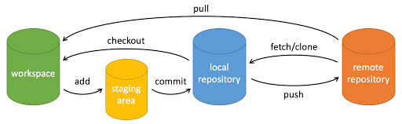

# Git

Git是什么？
Git是目前世界上最先进的分布式版本控制系统（没有之一）。

# Git 安装
- https://git-scm.com/downloads

# Git 官方文档
- https://book.git-scm.com/

# 全局配置
- git config global user.name=xxxx
- git config globle user.email=xxxx@xxx.com 
  

# 常用操作

- git init 创建仓库，在目标文件夹下，执行 git init 以创建新的 git 仓库
- git clone /path/to/repository 将远程仓库拉到本地
- git add 
  - git add \<file>  将文件添加到 `stage area`。
  - git add *   将所有记录在案的文件 添加到 `stage area`
- git rm 
- git mv
- git commit -m "代码提交信息"  *你的改动已经提交到了 **Local Repository**，但是还没到你的远端仓库。*
- git push origin \<branchname>   [其中 origin 是远程仓库的本地名称。]， 如果没有，可以使用如下命令添加
  - git remote add origin \<server>
  - git remote -v  可以查看当前的远程分支信息。
- git log  查看当前分支的提交日志。
- git diff [\<file>] 查看 [指定文件] 变更内容
- git blame \<file> 查看单个文件的历史修改记录

## 分支

- git checkout -b feature  创建新分支 feature 并切换过去
- git checkout master  切换到master 分支
- git branch -d feature 删除 feature 分支
- git pull 更新服务器代码到本地（修改本地文件）
- git fetch 获取服务器代码最新改动，（不修改本地文件）
- git merge \<branch> 合并其他分支的代码到当前分支。(非线性)
- git rebase （线性合并）
- git cherry-pick 

## conflicts
- git pull, git merge 都会尝试去自动合并改动。但这并不是每次都能成功，可能会出现冲突（conflicts）。 这时候就需要你修改这些文件来手动合并这些冲突（conflicts）。改完之后，你需要执行如下命令以将它们标记为合并成功：
git add \<file>

## 谨慎使用系列
- git checkout -- \<file> 将本地文件替换成代码仓库内的文件
- git reset --hard origin/master  将本地所有修改都忽略掉，强制使用仓库内的代码。
- git push -f 强制将本地仓库的信息覆盖远程仓库

## Git 常用软件
- [TortoiseGit](https://tortoisegit.org/)
- [SmartGit](https://www.syntevo.com/smartgit/)
- [GitX](https://gitx.frim.nl/)
- [Source Tree](https://www.sourcetreeapp.com/)
- ...等

