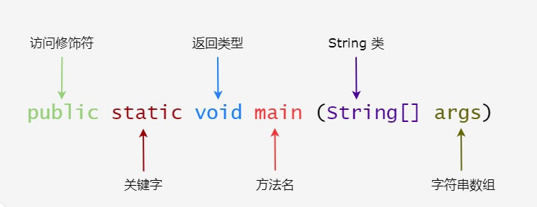

# 基础语法

 

## 关键词

- 对象：对象是类的一个实例，有状态和行为。

- 类：类是一个模板，它描述一类对象的行为和状态。
- 方法：方法就是行为，一个类可以有很多方法。
- 实例变量：每个对象都有实例变量，对象的状态由这些实例变量的值决定。
- 大小写敏感
- 类名：类名的首字母应该大写。如果类名由若干单词组成，那么每个单词的首字母应该大写，例如 MyFirstJavaClass 。
- 方法名：所有的方法名都应该以小写字母开头。如果方法名含有若干单词，则后面的每个单词首字母大写。
- 源文件名：源文件名必须和类名相同。当保存文件的时候，你应该使用类名作为文件名保存（切记 Java 是大小写敏感的），文件名的后缀为 .java。（如果文件名和类名不相同则会导致编译错误）。
- 主方法入口：所有的 Java 程序由 public static void main(String[] args) 方法开始执行。
- 标识符，所有组成部分的的名字。
  - 所有的标识符都应该以字母（A-Z 或者 a-z）,美元符（$）、或者下划线（_）开始
  - 首字符之后可以是字母（A-Z 或者 a-z）,美元符（$）、下划线（_）或数字的任何字符组合
  - 关键字不能用作标识符
  - 标识符是大小写敏感的
  - 合法标识符举例：age、$salary、_value、__1_value
  - 非法标识符举例：123abc、-salary
- 修饰符，来修饰类中方法和属性。
  - 访问控制类别的修饰符，如 default, public , protected, private
  - 非访问控制修饰符 : final, abstract, static, synchronized
- 变量
  - 局部变量
  - 类变量（静态变量）
  - 成员变量（非静态变量）
- 注释
  - // 单行注释法
  - /* ... */ 多行注释方法
- 包
  - package


## 实例

```
/**
 * class comment.
 */
public class Hello {
   
    public static void main(String[] args) {
        // 单行注释开始
        /*
          多行注释开始
          注释内容
          注释结束
        */
        sayHello("Ethan");
    }

    public static void sayHello(String name) {
        String strOutput = "hello" + name;
        // 向屏幕输出文本:
        System.out.println(strOutput);
    }

} // class结束
```
## 动态类型

- JAVA10 之后的 动态类型关键字 `var`, `jvm` 会自动推断是什么类型。 如
```
    public static void sayHello(String name) {
        String strOutput = "hello" + name;
        var strOutput2 = "hello" + name;
        // 向屏幕输出文本:
        System.out.println(strOutput);

        
        System.out.println(strOutput.getClass().getName());   // java.lang.String
        System.out.println(strOutput2.getClass().getName());  // java.lang.String
    }
```

