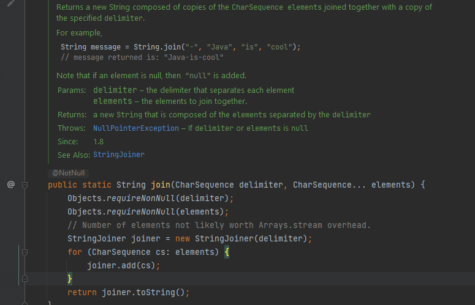
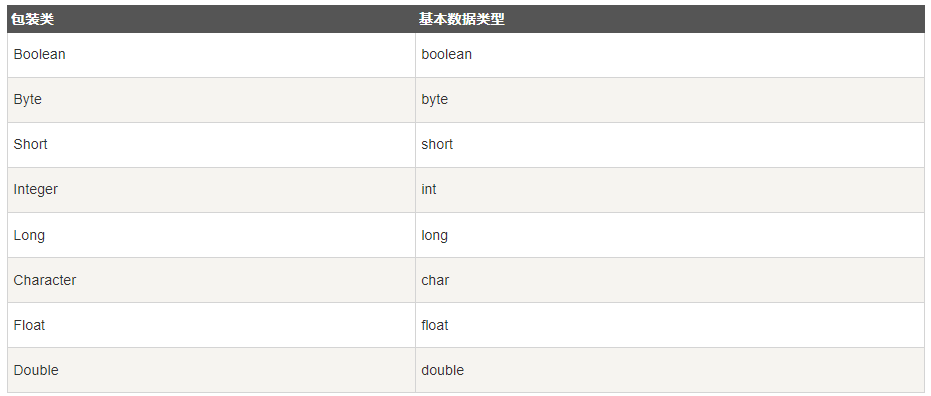

## 编码
在早期的计算机系统中，为了给字符编码，美国国家标准学会（American National Standard Institute：ANSI）制定了一套英文字母、数字和常用符号的编码，它占用一个字节，编码范围从0到127，最高位始终为0，称为`ASCII编码`。例如，字符`'A'`的编码是`0x41`，字符`'1'`的编码是`0x31`。

如果要把汉字也纳入计算机编码，很显然一个字节是不够的。`GB2312`标准使用两个字节表示一个汉字，其中第一个字节的最高位始终为1，以便和ASCII编码区分开。例如，汉字'中'的GB2312编码是0xd6d0。

类似的，日文有Shift_JIS编码，韩文有EUC-KR编码，这些编码因为标准不统一，同时使用，就会产生冲突。

为了统一全球所有语言的编码，全球统一码联盟发布了`Unicode`编码，它把世界上主要语言都纳入同一个编码，这样，中文、日文、韩文和其他语言就不会冲突。

Unicode编码需要两个或者更多字节表示，我们可以比较中英文字符在ASCII、GB2312和Unicode的编码：
英文字符'A'的ASCII编码和Unicode编码：


| 编码名称 |   编码   |
| :------- | :------: |
| ASCII    |    41    |
| Unicode  | 00 \| 41 |

英文字符的Unicode编码就是简单地在前面添加一个00字节。

中文字符'中'的GB2312编码和Unicode编码：


| 编码名称 |   编码   |
| :------- | :------: |
| GB2312   | d6 \| d0 |
| Unicode  | 4e \| 2d |


`UTF-8`又是什么编码呢？因为英文字符的`Unicode`编码高字节总是`00`，包含大量英文的文本会浪费空间，所以，出现了`UTF-8`编码，它是一种变长编码，用来把固定长度的Unicode编码变成1～4字节的变长编码。通过UTF-8编码，英文字符'A'的UTF-8编码变为0x41，正好和ASCII码一致，而中文'中'的UTF-8编码为3字节0xe4b8ad。

UTF-8编码的另一个好处是容错能力强。如果传输过程中某些字符出错，不会影响后续字符，因为UTF-8编码依靠高字节位来确定一个字符究竟是几个字节，它经常用来作为传输编码。

在Java中，char类型实际上就是两个字节的Unicode编码。如果我们要手动把字符串转换成其他编码，可以这样做：
```
byte[] b1 = "Hello".getBytes(); // 按系统默认编码转换，不推荐
byte[] b2 = "Hello".getBytes("UTF-8"); // 按UTF-8编码转换
byte[] b2 = "Hello".getBytes("GBK"); // 按GBK编码转换
byte[] b3 = "Hello".getBytes(StandardCharsets.UTF_8); // 按UTF-8编码转换
```

## StringBuilder
Java编译器对String做了特殊处理，使得我们可以直接用+拼接字符串。  

```
String s = "";
for (int i = 0; i < 1000; i++) {
    s = s + "," + i;
}
```
虽然可以直接拼接字符串，但是，在循环中，每次循环都会创建新的字符串对象，然后扔掉旧的字符串。这样，绝大部分字符串都是临时对象，不但浪费内存，还会影响GC效率。为了能高效拼接字符串，Java标准库提供了`StringBuilder`，它是一个可变对象，可以预分配缓冲区，这样，往`StringBuilder`中新增字符时，不会创建新的临时对象：
```
StringBuilder sb = new StringBuilder(1024);
for (int i = 0; i < 1000; i++) {
    sb.append(',');
    sb.append(i);
}
String s = sb.toString();
```

### 动手
将上面的代码改为  `StringBuilder` 的`链式`操作。

## StringJoiner
高效拼接字符串，可使用`StringBuilder`。
类似用分隔符拼接数组的需求很常见，所以Java标准库还提供了一个`StringJoiner`来干这个事, `String.join` 内部也是采用了 `StringJoiner` 进行实现.
```
public static void main(String[] args) {
        String[] names = {"Ethan", "Lee", "World"};
        var sj = new StringJoiner(", ", "Hello ", "!");
        for (String name : names) {
            sj.add(name);
        }
        System.out.println(sj.toString());
    }
```  
  
  string.join 的源码  

  


## Auto Boxing & Auto UnBoxing

- 实际开发过程中，我们经常会遇到需要使用对象，而不是内置数据类型的情形。为了解决这个问题，Java 语言为每一个`内置数据类型`提供了对应的包装类。
- 所有的包装类（`Integer`、`Long`、`Byte`、`Double`、`Float`、`Short`）都是抽象类 Number 的子类
- `autoboxing` 是指 Java 编译器自动将基本数据类型值转换成对应的包装类的对象，例如将 `int` 转换为 `Integer` 对象，将 `boolean` 转换问 `Boolean` 对象。而拆箱(`unboxing`)则是反过来转换。



### boxing & unboxing 的副作用
- 对象比较的结果 是地址比较，不是值比较。
- **Q&A** 执行如下两端代码，会得到不同的结果，为什么？
  - 比较 `Number` 类型数据，需要使用 `equals()`  

    ```
    public static void main(String[] args) {
        Integer number1 = 128;
        Integer number2 = 128;
        System.out.println("number1 == number2: " + (number1 == number2)); // false
    }
    ```
    ```
    public static void main(String[] args) {
        Integer number3 = 127;
        Integer number4 = 127;
        System.out.println("number3 == number4: " + (number3 == number4)); // true
    }
    ```
 - int -> Integer 对象的多次创建，内存的频繁申请释放。

## JavaBean
Bean 一般是一些数据的定义类，通常有如下特征。有`private` 属性，然后有对应的 `getXX()` 和 `setXX()` 方法

```
public class Person {
    private String name;
    private int age;

    public String getName() { return this.name; }
    public void setName(String name) { this.name = name; }

    public int getAge() { return this.age; }
    public void setAge(int age) { this.age = age; }
}
```  
要枚举一个JavaBean的所有属性，可以直接使用Java核心库提供的 `Introspector` ：
```
    try {
        BeanInfo info = Introspector.getBeanInfo(Person.class);
        for (PropertyDescriptor pd : info.getPropertyDescriptors()) {
            System.out.println(pd.getName());
            System.out.println("  " + pd.getReadMethod());
            System.out.println("  " + pd.getWriteMethod());
        }
    } catch (IntrospectionException e) {
        throw new RuntimeException(e);
    }
```

## 枚举
``` 
public class Weekday {
    public static final int SUN = 0;
    public static final int MON = 1;
    public static final int TUE = 2;
    public static final int WED = 3;
    public static final int THU = 4;
    public static final int FRI = 5;
    public static final int SAT = 6;
}
```

为了让编译器能自动检查某个值在枚举的集合内，并且，不同用途的枚举需要不同的类型来标记，不能混用，我们可以使用enum来定义枚举类：

```
public enum WeekDay {
    Sun,
    Mon,
    Tue,
    Wed,
    Tur,
    Fri,
    Sat
}
```

## BigInteger, BigDecimal
- java 中，由CPU原生提供的整型最大范围是64位`long`型整数。使用`long`型整数可以直接通过CPU指令进行计算，速度非常快。如果我们使用的整数范围超过了long型怎么办？这个时候，就只能用软件来模拟一个大整数。`java.math.BigInteger`就是用来表示任意大小的整数。
- BigDecimal可以表示一个任意大小且精度完全准确的浮点数。

```
BigInteger bi = new BigInteger("1234567890");
System.out.println(bi.pow(5)); // 2867971860299718107233761438093672048294900000

```

## 常用工具类

### Math
- java.lang.Math 包含了用于执行基本数学运算的属性和方法，如`初等指数`、`对数`、`平方根`和`三角函数` 等等。
- 随机数，向上，向下取整等
  - `Math.Random()`
  - `Math.ceil()`
  - `Math.floor()`
### Random
- 生成各种随机数。