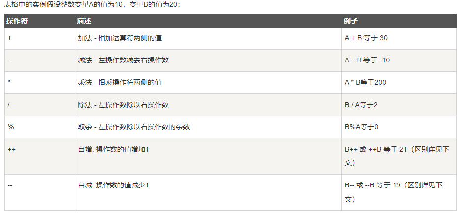
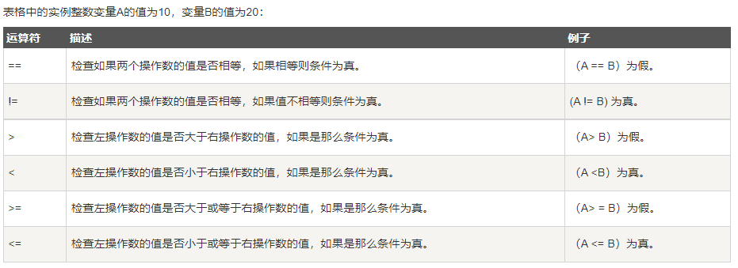
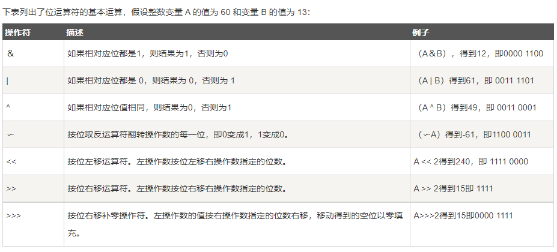
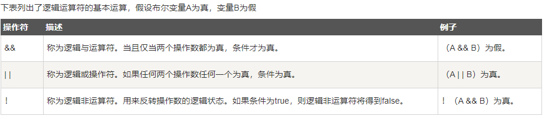
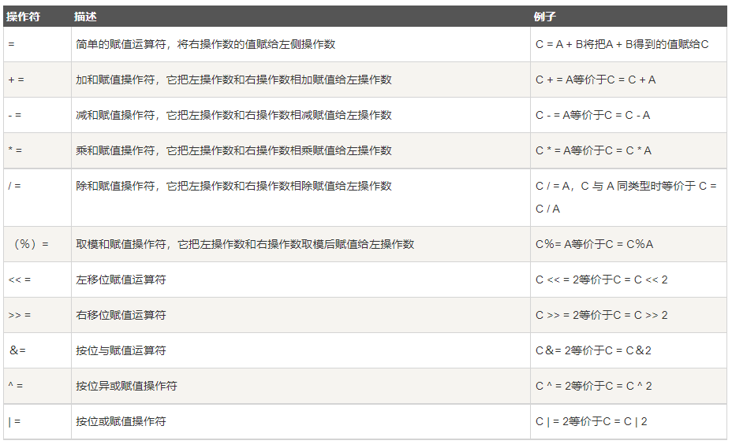
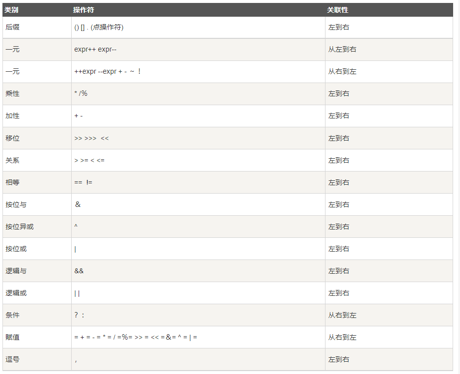

## 基础数据类型

| 类型    |    描述    |  长度  |        取值范围        |
| :------ | :--------: | :----: | :--------------------: |
| boolean |   布尔型   |        |     true 或 false      |
| byte    |   字节型   | 1 byte |       -128 ~ 127       |
| char    |   字符型   | 2 byte |                        |
| short   |   短整型   | 2 byte | -$2^{16}$~ $2^{15}$ -1 |
| int     |    整型    | 4 byte | -$2^{32}$~ $2^{31}$ -1 |
| float   | 单精度浮点 | 4 byte |                        |
| long    |   长整型   | 8 byte |                        |
| double  | 双精度浮点 | 8 byte |                        |

**`null`** 特殊类型

## 运算符

| 关键字     |            备注             |
| :--------- | :-------------------------: |
| 算术运算符 |  |
| 关系运算符 |  |
| 位运算符   |  |
| 逻辑运算符 |  |
| 赋值运算符 |  |
| 三元运算符 |             ? :             |
| 其他       |         instanceof          |

## 数学运算符优先级

最高优先级的运算符在的表的最上面，最低优先级的在表的底部。  

 

