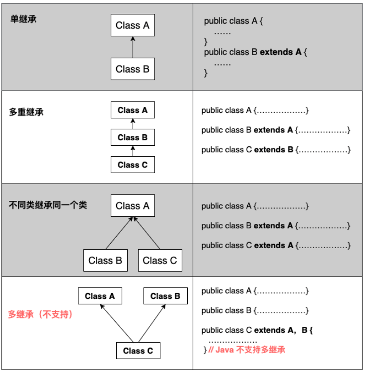

## Exends
前面 定义了`Person`类：
```
class Person {
    private String name;
    private int age;

    public String getName() {...}
    public void setName(String name) {...}
    public int getAge() {...}
    public void setAge(int age) {...}
}
```

现在新定义一个 `student` 类
```
class Student {
    private String name;
    private int age;
    private int score;

    public String getName() {...}
    public void setName(String name) {...}
    public int getAge() {...}
    public void setAge(int age) {...}
    public int getScore() { … }
    public void setScore(int score) { … }
}
```
很多内容一致， 所以 可以使用 `extends` 来实现相同的内容
```
class Person {
    private String name;
    private int age;

    public String getName() {...}
    public void setName(String name) {...}
    public int getAge() {...}
    public void setAge(int age) {...}
}

class Student extends Person {
    // 不要重复name和age字段/方法,
    // 只需要定义新增score字段/方法:
    private int score;

    public int getScore() { … }
    public void setScore(int score) { … }
}
```

- 继承不能访问 `private` 的变量和方法。
- 使用 `super` 访问父类 如 `super.xxx`
- 即子类不会继承任何父类的构造方法。子类默认的构造方法是编译器自动生成的，不是继承的。
- 如果父类没有默认的构造方法，子类就必须显式调用`super()`并给出参数以便让编译器定位到父类的一个合适的构造方法。
- 如果 `class` 不希望被继承， 则可以使用 `final` 关键字
- 类型强转

```
class Person {
    private String name;
    private int age;

    public String getName() {...}
    public void setName(String name) {...}
    public int getAge() {...}
    public void setAge(int age) {...}
}

class Student extends Person {
    // 不要重复name和age字段/方法,
    // 只需要定义新增score字段/方法:
    private int score;

    public int getScore() { … }
    public void setScore(int score) { … }
}

// 
Person p1 = new Student(); // upcasting, ok
Person p2 = new Person();
Student s1 = (Student) p1; // ok
Student s2 = (Student) p2; // runtime error! ClassCastException!
```

- 判断是否是 某个类型， `instanceof` 关键字, 如：  
  
```
if (s1 instanceof Student) {
    System.out.print("s1 is student.");
}
```


## Tips
- java15 之后， 可以使用 `sealed` 限制指定的类继承它。 如：
```
public sealed class Shape permits Rect, Circle, Triangle {
    ...
}
```
