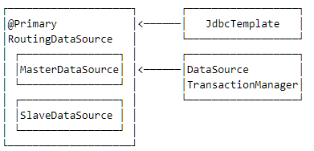

## 禁用DataSource Sample
Spring Boot大量使用自动配置和默认配置，极大地减少了代码，通常只需要加上几个注解，并按照默认规则设定一下必要的配置即可。例如，配置JDBC，默认情况下，只需要配置一个spring.datasource：  
```
spring:
  datasource:
    url: jdbc:hsqldb:file:testdb
    username: sa
    password:
    dirver-class-name: org.hsqldb.jdbc.JDBCDriver
```
Spring Boot就会自动创建出`DataSource`、`JdbcTemplate`、`DataSourceTransactionManager`，非常方便。  
但是，有时候，我们又必须要禁用某些自动配置。例如，系统有主从两个数据库，而Spring Boot的自动配置只能配一个，怎么办？  
这个时候，针对DataSource相关的自动配置，就必须关掉。我们需要用exclude指定需要关掉的自动配置：  
```
@SpringBootApplication
// 启动自动配置，但排除指定的自动配置:
@EnableAutoConfiguration(exclude = DataSourceAutoConfiguration.class)
public class Application {
    ...
}
```
现在，Spring Boot不再给我们自动创建`DataSource`、`JdbcTemplate`和`DataSourceTransactionManager`了，要实现主从数据库支持，怎么办？  
让我们一步一步开始编写支持主从数据库的功能。  
首先，我们需要把主从数据库配置写到application.yml中，仍然按照Spring Boot默认的格式写，但datasource改为`datasource-master`和`datasource-slave`：    
```
spring:
  datasource-master:
    url: jdbc:hsqldb:file:testdb
    username: sa
    password:
    dirver-class-name: org.hsqldb.jdbc.JDBCDriver
  datasource-slave:
    url: jdbc:hsqldb:file:testdb
    username: sa
    password:
    dirver-class-name: org.hsqldb.jdbc.JDBCDriver
```
注意到两个数据库实际上是同一个库。如果使用MySQL，可以创建一个只读用户，作为datasource-slave的用户来模拟一个从库。  
下一步，我们分别创建两个HikariCP的DataSource：  
```
public class MasterDataSourceConfiguration {
    @Bean("masterDataSourceProperties")
    @ConfigurationProperties("spring.datasource-master")
    DataSourceProperties dataSourceProperties() {
        return new DataSourceProperties();
    }

    @Bean("masterDataSource")
    DataSource dataSource(@Autowired @Qualifier("masterDataSourceProperties") DataSourceProperties props) {
        return props.initializeDataSourceBuilder().build();
    }
}

public class SlaveDataSourceConfiguration {
    @Bean("slaveDataSourceProperties")
    @ConfigurationProperties("spring.datasource-slave")
    DataSourceProperties dataSourceProperties() {
        return new DataSourceProperties();
    }

    @Bean("slaveDataSource")
    DataSource dataSource(@Autowired @Qualifier("slaveDataSourceProperties") DataSourceProperties props) {
        return props.initializeDataSourceBuilder().build();
    }
}
```
注意到上述class并未添加@Configuration和@Component，要使之生效，可以使用@Import导入：    
```
@SpringBootApplication
@EnableAutoConfiguration(exclude = DataSourceAutoConfiguration.class)
@Import({ MasterDataSourceConfiguration.class, SlaveDataSourceConfiguration.class})
public class Application {
    ...
}
```
此外，上述两个DataSource的Bean名称分别为`masterDataSource`和`slaveDataSource`，我们还需要一个最终的@Primary标注的DataSource，它采用Spring提供的AbstractRoutingDataSource，代码实现如下：  
```
class RoutingDataSource extends AbstractRoutingDataSource {
    @Override
    protected Object determineCurrentLookupKey() {
        // 从ThreadLocal中取出key:
        return RoutingDataSourceContext.getDataSourceRoutingKey();
    }
}
```
RoutingDataSource本身并不是真正的DataSource，它通过Map关联一组DataSource，下面的代码创建了包含两个DataSource的RoutingDataSource，关联的key分别为`masterDataSource`和`slaveDataSource`：  
```
public class RoutingDataSourceConfiguration {
    @Primary
    @Bean
    DataSource dataSource(
            @Autowired @Qualifier("masterDataSource") DataSource masterDataSource,
            @Autowired @Qualifier("slaveDataSource") DataSource slaveDataSource) {
        var ds = new RoutingDataSource();
        // 关联两个DataSource:
        ds.setTargetDataSources(Map.of(
                "masterDataSource", masterDataSource,
                "slaveDataSource", slaveDataSource));
        // 默认使用masterDataSource:
        ds.setDefaultTargetDataSource(masterDataSource);
        return ds;
    }

    @Bean
    JdbcTemplate jdbcTemplate(@Autowired DataSource dataSource) {
        return new JdbcTemplate(dataSource);
    }

    @Bean
    DataSourceTransactionManager dataSourceTransactionManager(@Autowired DataSource dataSource) {
        return new DataSourceTransactionManager(dataSource);
    }
}
```
仍然需要自己创建`JdbcTemplate`和`PlatformTransactionManager`，注入的是标记为`@Primary`的`RoutingDataSource`。

这样，我们通过如下的代码就可以切换`RoutingDataSource`底层使用的真正的`DataSource`：
```
RoutingDataSourceContext.setDataSourceRoutingKey("slaveDataSource");
jdbcTemplate.query(...);
```
只不过写代码切换DataSource即麻烦又容易出错，更好的方式是通过注解配合AOP实现自动切换，这样，客户端代码实现如下：  
```
@Controller
public class UserController {
	@RoutingWithSlave // <-- 指示在此方法中使用slave数据库
	@GetMapping("/profile")
	public ModelAndView profile(HttpSession session) {
        ...
    }
}
```
实现上述功能需要编写一个`@RoutingWithSlave`注解，一个AOP织入和一个`ThreadLocal`来保存key。由于代码比较简单，这里我们不再详述。  
如果我们想要确认是否真的切换了DataSource，可以覆写determineTargetDataSource()方法并打印出DataSource的名称：  
```
class RoutingDataSource extends AbstractRoutingDataSource {
    ...

    @Override
    protected DataSource determineTargetDataSource() {
        DataSource ds = super.determineTargetDataSource();
        logger.info("determin target datasource: {}", ds);
        return ds;
    }
}
```
访问不同的URL，可以在日志中看到两个`DataSource`，分别是HikariPool-1和hikariPool-2：  
```
2020-06-14 17:55:21.676  INFO 91561 --- [nio-8080-exec-7] c.i.learnjava.config.RoutingDataSource   : determin target datasource: HikariDataSource (HikariPool-1)
2020-06-14 17:57:08.992  INFO 91561 --- [io-8080-exec-10] c.i.learnjava.config.RoutingDataSource   : determin target datasource: HikariDataSource (HikariPool-2)
```
我们用一个图来表示创建的DataSource以及相关Bean的关系：   
  

注意到`DataSourceTransactionManager`和`JdbcTemplate`引用的都是`RoutingDataSource`，所以，这种设计的一个限制就是：在一个请求中，一旦切换了内部数据源，在同一个事务中，不能再切到另一个，否则，`DataSourceTransactionManager`和`JdbcTemplate`操作的就不是同一个数据库连接。