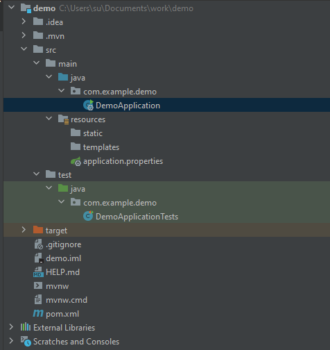

# 第一个Spring Boot应用程序
要了解Spring Boot，我们先来编写第一个Spring Boot应用程序，看看与前面我们编写的Spring应用程序有何异同。

我们新建一个`springboot-hello`的工程，创建标准的Maven目录结构如下：  


其中，在src/main/resources目录下，注意到几个文件：`application.properties`,  这是Spring Boot默认的配置文件，部分工程可能是 .yml后缀格式，不过都一样，只是格式稍微有区别。比较一下两者的区别：

使用.properties格式：  

```
# application.properties

spring.application.name=${APP_NAME:unnamed}

spring.datasource.url=jdbc:hsqldb:file:testdb
spring.datasource.username=sa
spring.datasource.password=
spring.datasource.dirver-class-name=org.hsqldb.jdbc.JDBCDriver

spring.datasource.hikari.auto-commit=false
spring.datasource.hikari.connection-timeout=3000
spring.datasource.hikari.validation-timeout=3000
spring.datasource.hikari.max-lifetime=60000
spring.datasource.hikari.maximum-pool-size=20
spring.datasource.hikari.minimum-idle=1
```  

使用YAML格式：  

```
# application.yml

spring:
  application:
    name: ${APP_NAME:unnamed}
  datasource:
    url: jdbc:hsqldb:file:testdb
    username: sa
    password:
    driver-class-name: org.hsqldb.jdbc.JDBCDriver
    hikari:
      auto-commit: false
      connection-timeout: 3000
      validation-timeout: 3000
      max-lifetime: 60000
      maximum-pool-size: 20
      minimum-idle: 1
```  
使用环境变量
在配置文件中，我们经常使用如下的格式对某个key进行配置：  

```
app:
  db:
    host: ${DB_HOST:localhost}
    user: ${DB_USER:root}
    password: ${DB_PASSWORD:password}
```
这种${DB_HOST:localhost}意思是，首先从环境变量查找DB_HOST，如果环境变量定义了，那么使用环境变量的值，否则，使用默认值localhost。

这使得我们在开发和部署时更加方便，因为开发时无需设定任何环境变量，直接使用默认值即本地数据库，而实际线上运行的时候，只需要传入环境变量即可：
```
$ DB_HOST=10.0.1.123 DB_USER=prod DB_PASSWORD=xxxx java -jar xxx.jar
```
`static`是静态文件目录，`templates`是模板文件目录，注意它们是直接放到src/main/resources这个classpath目录。
<!-- 因为在Spring Boot中已经不需要专门的webapp目录了。 -->

以上就是Spring Boot的标准目录结构，它完全是一个基于Java应用的普通Maven项目。

我们再来看源码目录结构：  

```
src/main/java
└── com
    └── example
        └── demo
            ├── DemoApplication.java
            ├── entity
            │   └── User.java
            ├── service
            │   └── UserService.java
            └── web
                └── UserController.java
```
在存放源码的src/main/java目录中，Spring Boot对Java包的层级结构有一个要求。注意到我们的根package是com.example.demo， 下面还有entity、service、web等子package。Spring Boot要求main()方法所在的启动类必须放到根package下，命名不做要求，这里我们以`DemoApplication.java`命名，它的内容如下：  

```
@SpringBootApplication
public class DemoApplication {

    public static void main(String[] args) {
        SpringApplication.run(DemoApplication.class, args);
    }
}
```

启动Spring Boot应用程序只需要一行代码加上一个注解`@SpringBootApplication`，该注解实际上又包含了：
```
@SpringBootConfiguration
@Configuration
@EnableAutoConfiguration
@AutoConfigurationPackage
@ComponentScan
```
这样一个注解就相当于启动了自动配置和自动扫描。

我们再观察pom.xml，它的内容如下：
<details>  

```
<?xml version="1.0" encoding="UTF-8"?>
<project xmlns="http://maven.apache.org/POM/4.0.0" xmlns:xsi="http://www.w3.org/2001/XMLSchema-instance"
         xsi:schemaLocation="http://maven.apache.org/POM/4.0.0 https://maven.apache.org/xsd/maven-4.0.0.xsd">
    <modelVersion>4.0.0</modelVersion>
    <parent>
        <groupId>org.springframework.boot</groupId>
        <artifactId>spring-boot-starter-parent</artifactId>
        <version>2.7.4</version>
        <relativePath/> <!-- lookup parent from repository -->
    </parent>
    <groupId>com.example</groupId>
    <artifactId>demo</artifactId>
    <version>0.0.1-SNAPSHOT</version>
    <name>demo</name>
    <description>Demo project for Spring Boot</description>
    <properties>
        <java.version>11</java.version>
        <repackage.classifier/>
        <spring-native.version>0.12.1</spring-native.version>
    </properties>
    <dependencies>
        <dependency>
            <groupId>org.springframework.boot</groupId>
            <artifactId>spring-boot-starter-thymeleaf</artifactId>
        </dependency>
        <dependency>
            <groupId>org.springframework.boot</groupId>
            <artifactId>spring-boot-starter-web</artifactId>
        </dependency>
        <dependency>
            <groupId>org.springframework.experimental</groupId>
            <artifactId>spring-native</artifactId>
            <version>${spring-native.version}</version>
        </dependency>

        <dependency>
            <groupId>org.springframework.boot</groupId>
            <artifactId>spring-boot-devtools</artifactId>
            <scope>runtime</scope>
            <optional>true</optional>
        </dependency>
        <dependency>
            <groupId>org.projectlombok</groupId>
            <artifactId>lombok</artifactId>
            <optional>true</optional>
        </dependency>
        <dependency>
            <groupId>org.springframework.boot</groupId>
            <artifactId>spring-boot-starter-test</artifactId>
            <scope>test</scope>
        </dependency>
    </dependencies>

    <build>
        <plugins>
            <plugin>
                <groupId>org.springframework.boot</groupId>
                <artifactId>spring-boot-maven-plugin</artifactId>
                <configuration>
                    <excludes>
                        <exclude>
                            <groupId>org.projectlombok</groupId>
                            <artifactId>lombok</artifactId>
                        </exclude>
                    </excludes>
                    <classifier>${repackage.classifier}</classifier>
                    <image>
                        <builder>paketobuildpacks/builder:tiny</builder>
                        <env>
                            <BP_NATIVE_IMAGE>true</BP_NATIVE_IMAGE>
                        </env>
                    </image>
                </configuration>
            </plugin>
            <plugin>
                <groupId>org.springframework.experimental</groupId>
                <artifactId>spring-aot-maven-plugin</artifactId>
                <version>${spring-native.version}</version>
                <executions>
                    <execution>
                        <id>test-generate</id>
                        <goals>
                            <goal>test-generate</goal>
                        </goals>
                    </execution>
                    <execution>
                        <id>generate</id>
                        <goals>
                            <goal>generate</goal>
                        </goals>
                    </execution>
                </executions>
            </plugin>
        </plugins>
    </build>
    <repositories>
        <repository>
            <id>spring-releases</id>
            <name>Spring Releases</name>
            <url>https://repo.spring.io/release</url>
            <snapshots>
                <enabled>false</enabled>
            </snapshots>
        </repository>
    </repositories>
    <pluginRepositories>
        <pluginRepository>
            <id>spring-releases</id>
            <name>Spring Releases</name>
            <url>https://repo.spring.io/release</url>
            <snapshots>
                <enabled>false</enabled>
            </snapshots>
        </pluginRepository>
    </pluginRepositories>

    <profiles>
        <profile>
            <id>native</id>
            <properties>
                <repackage.classifier>exec</repackage.classifier>
                <native-buildtools.version>0.9.13</native-buildtools.version>
            </properties>
            <dependencies>
                <dependency>
                    <groupId>org.junit.platform</groupId>
                    <artifactId>junit-platform-launcher</artifactId>
                    <scope>test</scope>
                </dependency>
            </dependencies>
            <build>
                <plugins>
                    <plugin>
                        <groupId>org.graalvm.buildtools</groupId>
                        <artifactId>native-maven-plugin</artifactId>
                        <version>${native-buildtools.version}</version>
                        <extensions>true</extensions>
                        <executions>
                            <execution>
                                <id>test-native</id>
                                <phase>test</phase>
                                <goals>
                                    <goal>test</goal>
                                </goals>
                            </execution>
                            <execution>
                                <id>build-native</id>
                                <phase>package</phase>
                                <goals>
                                    <goal>build</goal>
                                </goals>
                            </execution>
                        </executions>
                    </plugin>
                </plugins>
            </build>
        </profile>
    </profiles>

</project>

```

</details>  

使用Spring Boot时，强烈推荐从spring-boot-starter-parent继承，因为这样就可以引入Spring Boot的预置配置。

紧接着，我们引入了依赖`spring-boot-starter-web`和spring-boot-starter-jdbc，它们分别引入了Spring MVC相关依赖和Spring JDBC相关依赖，无需指定版本号，因为引入的<parent>内已经指定了，只有我们自己引入的某些第三方jar包需要指定版本号。现在就可以直接运行Application，启动后观察Spring Boot的日志：  

<details>  

```
"C:\Program Files\Java\jdk-11.0.16.1\bin\java.exe" -XX:TieredStopAtLevel=1 -noverify -Dspring.output.ansi.enabled=always "-javaagent:C:\Program Files\JetBrains\IntelliJ IDEA 2021.1.3\lib\idea_rt.jar=51945:C:\Program Files\JetBrains\IntelliJ IDEA 2021.1.3\bin" -Dcom.sun.management.jmxremote -Dspring.jmx.enabled=true -Dspring.liveBeansView.mbeanDomain -Dspring.application.admin.enabled=true -Dfile.encoding=UTF-8 -classpath C:\Users\su\Documents\work\demo\target\classes;C:\Users\su\.m2\repository\org\springframework\boot\spring-boot-starter-thymeleaf\2.7.4\spring-boot-starter-thymeleaf-2.7.4.jar;C:\Users\su\.m2\repository\org\springframework\boot\spring-boot-starter\2.7.4\spring-boot-starter-2.7.4.jar;C:\Users\su\.m2\repository\org\springframework\boot\spring-boot-starter-logging\2.7.4\spring-boot-starter-logging-2.7.4.jar;C:\Users\su\.m2\repository\ch\qos\logback\logback-classic\1.2.11\logback-classic-1.2.11.jar;C:\Users\su\.m2\repository\ch\qos\logback\logback-core\1.2.11\logback-core-1.2.11.jar;C:\Users\su\.m2\repository\org\apache\logging\log4j\log4j-to-slf4j\2.17.2\log4j-to-slf4j-2.17.2.jar;C:\Users\su\.m2\repository\org\apache\logging\log4j\log4j-api\2.17.2\log4j-api-2.17.2.jar;C:\Users\su\.m2\repository\org\slf4j\jul-to-slf4j\1.7.36\jul-to-slf4j-1.7.36.jar;C:\Users\su\.m2\repository\jakarta\annotation\jakarta.annotation-api\1.3.5\jakarta.annotation-api-1.3.5.jar;C:\Users\su\.m2\repository\org\yaml\snakeyaml\1.30\snakeyaml-1.30.jar;C:\Users\su\.m2\repository\org\thymeleaf\thymeleaf-spring5\3.0.15.RELEASE\thymeleaf-spring5-3.0.15.RELEASE.jar;C:\Users\su\.m2\repository\org\thymeleaf\thymeleaf\3.0.15.RELEASE\thymeleaf-3.0.15.RELEASE.jar;C:\Users\su\.m2\repository\org\attoparser\attoparser\2.0.5.RELEASE\attoparser-2.0.5.RELEASE.jar;C:\Users\su\.m2\repository\org\unbescape\unbescape\1.1.6.RELEASE\unbescape-1.1.6.RELEASE.jar;C:\Users\su\.m2\repository\org\slf4j\slf4j-api\1.7.36\slf4j-api-1.7.36.jar;C:\Users\su\.m2\repository\org\thymeleaf\extras\thymeleaf-extras-java8time\3.0.4.RELEASE\thymeleaf-extras-java8time-3.0.4.RELEASE.jar;C:\Users\su\.m2\repository\org\springframework\boot\spring-boot-starter-web\2.7.4\spring-boot-starter-web-2.7.4.jar;C:\Users\su\.m2\repository\org\springframework\boot\spring-boot-starter-json\2.7.4\spring-boot-starter-json-2.7.4.jar;C:\Users\su\.m2\repository\com\fasterxml\jackson\core\jackson-databind\2.13.4\jackson-databind-2.13.4.jar;C:\Users\su\.m2\repository\com\fasterxml\jackson\core\jackson-annotations\2.13.4\jackson-annotations-2.13.4.jar;C:\Users\su\.m2\repository\com\fasterxml\jackson\core\jackson-core\2.13.4\jackson-core-2.13.4.jar;C:\Users\su\.m2\repository\com\fasterxml\jackson\datatype\jackson-datatype-jdk8\2.13.4\jackson-datatype-jdk8-2.13.4.jar;C:\Users\su\.m2\repository\com\fasterxml\jackson\datatype\jackson-datatype-jsr310\2.13.4\jackson-datatype-jsr310-2.13.4.jar;C:\Users\su\.m2\repository\com\fasterxml\jackson\module\jackson-module-parameter-names\2.13.4\jackson-module-parameter-names-2.13.4.jar;C:\Users\su\.m2\repository\org\springframework\boot\spring-boot-starter-tomcat\2.7.4\spring-boot-starter-tomcat-2.7.4.jar;C:\Users\su\.m2\repository\org\apache\tomcat\embed\tomcat-embed-core\9.0.65\tomcat-embed-core-9.0.65.jar;C:\Users\su\.m2\repository\org\apache\tomcat\embed\tomcat-embed-el\9.0.65\tomcat-embed-el-9.0.65.jar;C:\Users\su\.m2\repository\org\apache\tomcat\embed\tomcat-embed-websocket\9.0.65\tomcat-embed-websocket-9.0.65.jar;C:\Users\su\.m2\repository\org\springframework\spring-web\5.3.23\spring-web-5.3.23.jar;C:\Users\su\.m2\repository\org\springframework\spring-beans\5.3.23\spring-beans-5.3.23.jar;C:\Users\su\.m2\repository\org\springframework\spring-webmvc\5.3.23\spring-webmvc-5.3.23.jar;C:\Users\su\.m2\repository\org\springframework\spring-aop\5.3.23\spring-aop-5.3.23.jar;C:\Users\su\.m2\repository\org\springframework\spring-context\5.3.23\spring-context-5.3.23.jar;C:\Users\su\.m2\repository\org\springframework\spring-expression\5.3.23\spring-expression-5.3.23.jar;C:\Users\su\.m2\repository\org\springframework\experimental\spring-native\0.12.1\spring-native-0.12.1.jar;C:\Users\su\.m2\repository\org\springframework\boot\spring-boot-devtools\2.7.4\spring-boot-devtools-2.7.4.jar;C:\Users\su\.m2\repository\org\springframework\boot\spring-boot\2.7.4\spring-boot-2.7.4.jar;C:\Users\su\.m2\repository\org\springframework\boot\spring-boot-autoconfigure\2.7.4\spring-boot-autoconfigure-2.7.4.jar;C:\Users\su\.m2\repository\org\projectlombok\lombok\1.18.24\lombok-1.18.24.jar;C:\Users\su\.m2\repository\org\springframework\spring-core\5.3.23\spring-core-5.3.23.jar;C:\Users\su\.m2\repository\org\springframework\spring-jcl\5.3.23\spring-jcl-5.3.23.jar com.example.demo.DemoApplication
15:56:26.406 [Thread-0] DEBUG org.springframework.boot.devtools.restart.classloader.RestartClassLoader - Created RestartClassLoader org.springframework.boot.devtools.restart.classloader.RestartClassLoader@1ef2529b
2022-09-30 15:56:26.657  INFO 12724 --- [  restartedMain] o.s.nativex.NativeListener               : AOT mode disabled

  .   ____          _            __ _ _
 /\\ / ___'_ __ _ _(_)_ __  __ _ \ \ \ \
( ( )\___ | '_ | '_| | '_ \/ _` | \ \ \ \
 \\/  ___)| |_)| | | | | || (_| |  ) ) ) )
  '  |____| .__|_| |_|_| |_\__, | / / / /
 =========|_|==============|___/=/_/_/_/
 :: Spring Boot ::                (v2.7.4)

2022-09-30 15:56:26.711  INFO 12724 --- [  restartedMain] com.example.demo.DemoApplication         : Starting DemoApplication using Java 11.0.16.1 on softusing with PID 12724 (C:\Users\su\Documents\work\demo\target\classes started by su in C:\Users\su\Documents\work\demo)
2022-09-30 15:56:26.711  INFO 12724 --- [  restartedMain] com.example.demo.DemoApplication         : No active profile set, falling back to 1 default profile: "default"
2022-09-30 15:56:26.763  INFO 12724 --- [  restartedMain] .e.DevToolsPropertyDefaultsPostProcessor : Devtools property defaults active! Set 'spring.devtools.add-properties' to 'false' to disable
2022-09-30 15:56:26.763  INFO 12724 --- [  restartedMain] .e.DevToolsPropertyDefaultsPostProcessor : For additional web related logging consider setting the 'logging.level.web' property to 'DEBUG'
2022-09-30 15:56:27.476  INFO 12724 --- [  restartedMain] o.s.b.w.embedded.tomcat.TomcatWebServer  : Tomcat initialized with port(s): 8080 (http)
2022-09-30 15:56:27.476  INFO 12724 --- [  restartedMain] o.apache.catalina.core.StandardService   : Starting service [Tomcat]
2022-09-30 15:56:27.476  INFO 12724 --- [  restartedMain] org.apache.catalina.core.StandardEngine  : Starting Servlet engine: [Apache Tomcat/9.0.65]
2022-09-30 15:56:27.539  INFO 12724 --- [  restartedMain] o.a.c.c.C.[Tomcat].[localhost].[/]       : Initializing Spring embedded WebApplicationContext
2022-09-30 15:56:27.539  INFO 12724 --- [  restartedMain] w.s.c.ServletWebServerApplicationContext : Root WebApplicationContext: initialization completed in 775 ms
2022-09-30 15:56:27.737  WARN 12724 --- [  restartedMain] ion$DefaultTemplateResolverConfiguration : Cannot find template location: classpath:/templates/ (please add some templates, check your Thymeleaf configuration, or set spring.thymeleaf.check-template-location=false)
2022-09-30 15:56:27.784  WARN 12724 --- [  restartedMain] o.s.b.d.a.OptionalLiveReloadServer       : Unable to start LiveReload server
2022-09-30 15:56:27.822  INFO 12724 --- [  restartedMain] o.s.b.w.embedded.tomcat.TomcatWebServer  : Tomcat started on port(s): 8080 (http) with context path ''
2022-09-30 15:56:27.824  INFO 12724 --- [  restartedMain] com.example.demo.DemoApplication         : Started DemoApplication in 1.408 seconds (JVM running for 2.394)

```
</details>  

`Spring Boot`自动启动了嵌入式`Tomcat`，当看到`Started Application in xxx seconds`时，Spring Boot应用启动成功。

现在，我们在浏览器输入`localhost:8080`就可以直接访问页面。
