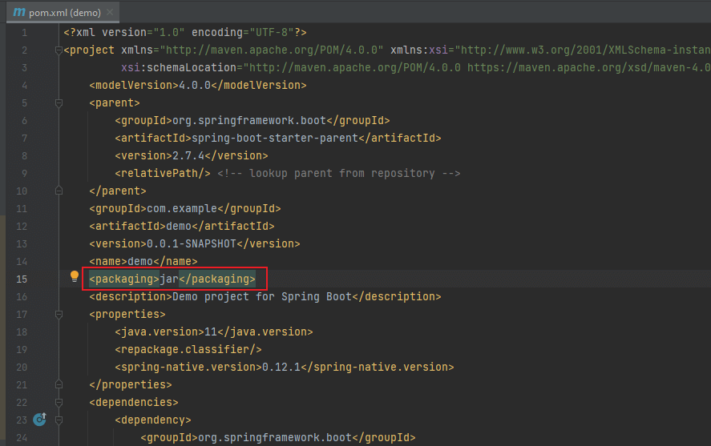
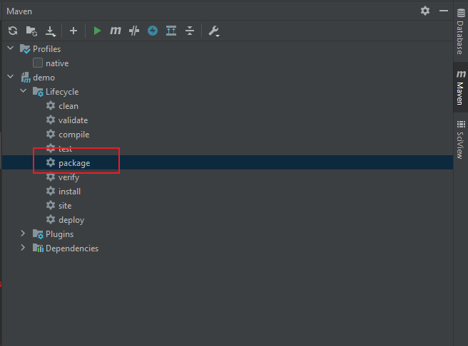

# Package 
Springboot 工程可被打包成 `jar` 和 `war` 两种格式。两者的区别如下：
- war是一个web模块，其中需要包括WEB-INF，是可以直接运行的WEB模块；jar一般只是包括一些class文件，在声明了Main_class之后是可以用java命令运行的。

- war包是做好一个web应用后，通常是网站，打成包部署到容器中；jar包通常是开发时要引用通用类，打成包便于存放管理。

- war是Sun提出的一种Web应用程序格式，也是许多文件的一个压缩包。这个包中的文件按一定目录结构来组织；classes目录下则包含编译好的Servlet类和Jsp或Servlet所依赖的其它类（如JavaBean）可以打包成jar放到WEB-INF下的lib目录下。

pom.xml 类的配置。   
```
<project ...>
    ...
    <build>
        <plugins>
            <plugin>
                <groupId>org.springframework.boot</groupId>
                <artifactId>spring-boot-maven-plugin</artifactId>
            </plugin>
        </plugins>
    </build>
</project>
```
  
  

## 延伸
这种方式打包出来的文件通常都非常大，空包打出来就有18M. 怎么解决呢？
**Tip:** ： spring-boot-thin-launcher
