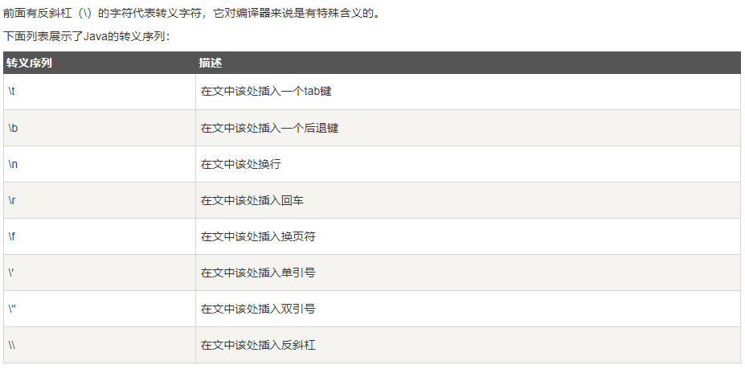

## Character

- \u#### 表示一个Unicode编码的字符
```
public static void main(String[] args) {
    System.out.println("输出\"引号!\"。");
    String s = "ABC\n\u4e2d\u6587"; // 包含6个字符: A, B, C, 换行符, 中, 文
    System.out.println(s);
}
```

## String
- 字符串对象
- 本身是引用类型
- Java字符串的一个重要特点就是字符串不可变。这种不可变性是通过内部的`private final char[]`字段，以及没有任何修改char[]的方法实现的。
- Q&A 比较如下的值， 判断输出的值怎么样。
  ```
    String s1 = "Ethan";                // String 直接创建
    String s2 = "Ethan";                // String 直接创建
    String s3 = s1;                     // 相同引用
    String s4 = new String("Ethan");    // String 对象创建
    String s5 = new String("Ethan");    // String 对象创建
    System.out.println("s3.compare s2: " + s3.compareTo(s2));  // 0
    System.out.println("s4.compare s5: " + s4.compareTo(s5));  // 0
    System.out.println("s4 == s5 :" + (s4 == s5) );  // false
  ```
- 字符串格式化
  ```
  String fs = String.format("浮点型变量的值为 %f, 整型变量的值为  %d, 字符串变量的值为  %s", floatVar, intVar, stringVar);
  ```
  Q： 格式化输出日期时间
- 字符串拼接
  - .concat
  - \+
  - StringBuilder, StringBuffer 的使用方法。
