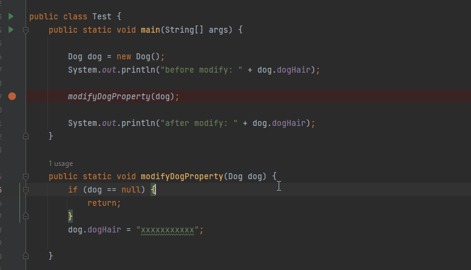
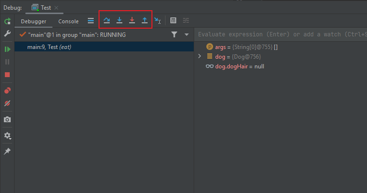
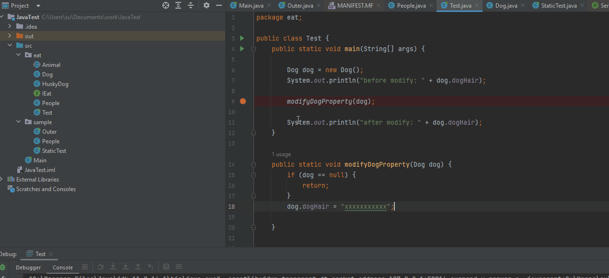
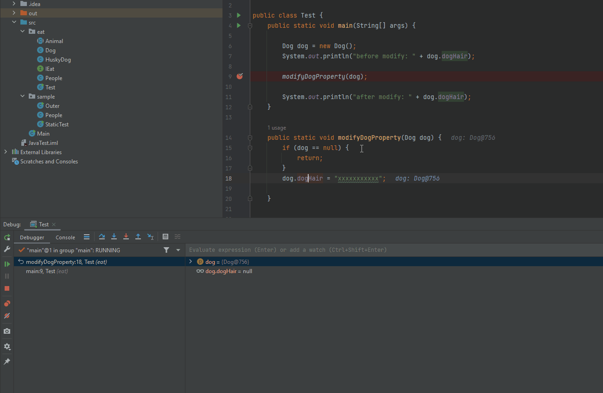

# IDEA 开发工具的使用
- 如何设置断点  

- debug 窗口以及快捷键熟悉  

- 逐行执行程序
- 进入到方法内调试
- 跳出方法调试
- 继续运行到下一个断点
- 查看方法调用栈
- 在debug时查看变量的值。
- Watch 功能如何使用
- 在debug时 计算表达式的值。
- 为断点设置条件。  
  
  
- 使用日志辅助 debug。

## 完整调试效果
