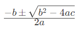

## 数据类型大小和默认值
- 补全基础数据类型的最小值和最大值。
- 整理基础数据类型的默认值。

## 输入值判断
使用 `scanner` 实现 **循环输入**。
- 当输入 `q` 时， 结束程序的执行。
- 当输入的值为 数字 时：
  - 用 `if ... else ...` 实现如下功能
  - 大于 `80`， 则输出 `优秀`。
  - 大于 `60`， 则输出 `及格`。
  - 其他， 则输出 `待定`。
- 当输入的值是 字符串 时：
  - 用 `switch case` 实现如下功能
    - 输入内容为 `perfect` 则输出：`80-100`
    - 输入内容为 `good，` 则输出：`60-80`
    - 其他，则输出：`less than 60`.
- 当输入为 `exit` 时：
  - 结束程序。

### 要求
- 循环输入只能使用 `while` 或者 `do ... while` 或者 `for` 进行实现。

### 禁止内容
- 禁止使用 正则式,
- 禁止使用 `Integer.parseInt`, `Float.parseFloat`, `Double.parseDouble`  等类似的方法。

### Tips
- 控制台输入 采用 `java.util.Scanner` 相关类。


## 一元二次方程求解
根据一元二次方程 `ax^2+bx+c=0` 的求根公式：

来计算一元二次方程的两个解。

### 要求
- 手动循环输入 a, b, c 的值。(整形)

### Tips
- 求平方根可用 `Math.sqrt()`.    
 

## 求和和平均值
将输入的内容进行分隔(`英语 逗号` 进行分割)，根据最后一个字符串的内容进行指定计算。要求如下：
### 要求
- 基础题：
  - 过滤掉非数字类型的字符串。
  - 输出所有的数字。
  - 最后一个字符串，如果是 合计 则统计前面所有数字的和， 如果是平均，则统计所有数字的平均值。
  - 将当前的时间 按 xxxx年x月xx日 xx点x分x秒 的格式输出
  ```
  如输入数据为：ABCD,12345,acv1213,3434,567786,er33,合计
  输出：
  12345 是数字。
  3434 是数字。
  567786 是数字。
  合計：12345+3434+567786=583565
  当前时间为： 2022年9月21日 14点0分0秒
  ```
  
- 进阶题：
  1. 输入的数据可以循环输入，直到输入需要处理的`计算方式`（`合计`或者`平均`为止）
  2. 输入的数字 支持 小数。
- 输出内容时必须使用格式化输出。

**附：基础题必做，进阶题选做。**

### Tips
- 控制台输入 采用 `java.util.Scanner` 相关类。

### 禁止内容
- 禁止使用 `正则式`,
- 禁止使用 `Integer.parseInt`, `Float.parseFloat`, `Double.parseDouble`  等类似的方法。

## 水仙花数
- 输出所有的水仙花数
  
附：水仙花数是指一个 3 位数，它的每个位上的数字的 3次幂之和等于它本身。例如：1^3 + 5^3+ 3^3 = 153。

## 质数
- 输出100内的所有的质数
  
附：质数是指在大于1的自然数中，除了1和它本身以外不再有其他因数的自然数。 如： 2，3，5，7，11，13，等

## 数字按位拆解
- 将输入的数字（长度大于1位）拆解为如下样式。

e.g.
```
输入： 12345 
输出： 12345 = 1*10000 + 2*1000 + 3*100 + 4*10+5

输入: 46
输出：46 = 4*10+6
```
### Tips
- 控制台输入 采用 `java.util.Scanner` 相关类。
