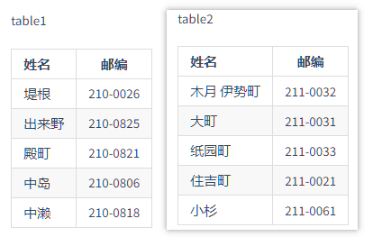

## 题目
- 输出文案： 「请输入内容」， 等待输入，然后将输入的内容用  `str` 进行存储。(e.g：输入的内容：2100818,softusing,japan-working,2100026,2zz3xxa)
- 将第一步输入的内容 `str` 拆分为数组 `strArray`， 用`英文逗号`进行分割，遍历 `strArray` 的元素并输出。
- 遍历 `strArray`, 判断单个元素是否是 邮编编号， 如果是邮编编号，将 `索引`和`值`都进行输出。  (邮编编号判断规则：长度为7位的数字)
- 参照如下两组数据数据  
  
  - 抽出 邮编和名字，对应输出。  如： [`2100026`] 是 [`堤根`].
  - 如果输入的内容不是邮编，则输出： [`xxx`] 不是邮编。
  - 如果输入的内容是邮编，则在 table1 和 table2 中进行查找，若找到则输出 对应所在的表的`索引 和 姓名`。  
  
  ```
  输入：2110031
  输出：在 table2 中， 名字是 [大町]

  输入：2100818
  输出：在 table1 中， 名字是 [大町]

  输入： 2110001
  输出：没有找到这个邮编地址。  
  ```
### 要求
- 禁止使用 `正则式`
- 两组数据判断时，只能使用 `数组`，`HashMap` 相关。 禁止使用 `switch ... case `,  `if ... else ...` 进行比较  

### Tips
- 控制台输入 采用 `java.util.Scanner` 相关类。
